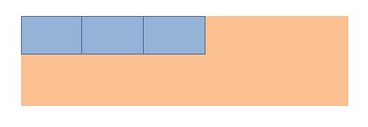
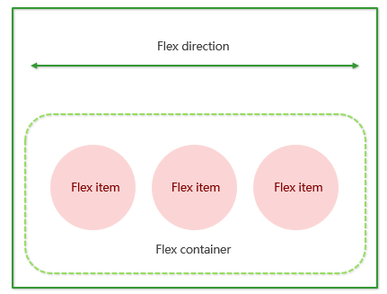

# rem 布局

* 流式布局、flex布局在宽度上控制的布局，高度基本上靠内部子元素撑起来，内部子元素有高度；
* rem布局，最为直观的效果，页面全部元素现实**等比**缩放，包括文字，盒子大小；


# rem 单位

* em：代表一个字符（1em = 代表父亲的字体大小）

* rem单位，可以控制整个页面所有元素有关PX类；（宽、高、padding、margin、top...）只要是你设置数值的地方都可以实现控制；

## 语法

* root:   1rem=HTML的font-size大小；
* 语法：

```css
/* 1.根html 为 15px */
html {
   font-size: 15px;
}

/* 2.此时 div 的宽就是 100px */       
div {
    width: 10rem;
}
```

* 特点：绝对的唯一控制；

  


# 媒体查询

* 作用：响应屏幕的变化；

* 该可以根据屏幕不同的宽，从而获得不同的样式，然后实现不同的样式显示；

## 语法

* CSS3 新语法，是一个查询屏幕的过程，通过查询当前屏幕尺寸属于**哪个范围**，从而有**哪个范围**的样式生效；
* `mediatype  (media feature)` 都是它的查询条件

```css
@media mediatype and|not|only (media feature) {
    CSS-Code;
}
```

* mediatype：媒体类型；查询不同的终端设备 ； screen最为常用：查询当前设置的屏幕；



* and|not|only：关键字；将多个条件连接在一起共同查询；
  * **and**：可以将多个媒体特性连接到一起，相当于“且”的意思；最为常用；生活中：“我既要娶白富美，又要走上人生颠覆”；
  * not：排除 某个 媒体类型，相当于“非”的意思，可以省略。生活：“我喜欢看电影，除了恐怖片”；
  * only：指定某个特定的 媒体类型，可以省略。    生活：“我这辈子非你不嫁”；
* (media feature)：媒体特性；
  * 对于屏幕 screen，屏幕的宽度就是一个特性；


* 实例：
  * 查询条件加小括号；
  * min-width/max-width：最小界值，最大界值；查询条件包含等于号；

```css
/* 宽度的最小界值500px，大于等于500px */
@media screen and (min-width:500px) {
    body {
        background-color: red;
    }
}
```

## 档位划分

* 划分要求：
  * 档位1：w<540px      w <= 539px; 
  * 档位2:   540px<= w  and  w< 640px;
  * 档位3:  640px<= w 


* 语法实现：

```css
        @media screen and (max-width: 539px) {
            body {
                background-color: blue;
            }
        }
        @media screen and (min-width: 540px) and (max-width: 639px) {
            body {
                background-color: green;
            }
        }
        @media screen and (min-width: 640px) {
            body {
                background-color: red;
            }
        }
```

* 第二档位可简写为：

```css
        @media screen and (min-width: 540px) {
            body {
                background-color: green;
            }
        }
```

* 图示：


* 特点：划分屏幕，等待变化；

 ## 资源引入（了解）

* 语法：不常用

```html
<!-- 320px~640px -->
<link rel="stylesheet" href="style320.css" media="screen and (min-width: 320px)">
<!-- n>=640px -->
<link rel="stylesheet" href="style640.css" media="screen and (min-width: 640px)">
```


# rem+媒体查询 初体验

* rem布局的核心：rem+媒体查询；

  * rem：唯一控制；只要盒子用rem作为单位，**当 HTML字体大小发生改变，使用rem单位元素都会发生改变；**
  * 媒体查询：把屏幕划分不同档位，等待变化；
  * rem+媒体查询加在一起：划分屏幕，等待变化；变化谁？变化唯一控制 rem（HTML字体大小）
* 语法：

```css
    @media screen and (min-width: 320px) {
      html {
        font-size: 50px;
      }
    }
    
    @media screen and (min-width: 640px) {
      html {
        font-size: 100px;
      }
    }
    
    .top {
      width:1.75rem;
      height:5.25rem;
    }
```

* rem布局的核心：
  * 媒体查询：屏幕到达不同的范围下，HTML的font-sizing大小会有不同的取值;  
  * 1rem背后的代表的PX值 = 当前档位 HTML 字体大小 所代表的大小
  * rem：那么使用rem单位的元素就会发生等比的变化；

- 图示：不同档位下盒子显示的大小；


* 实际开发过程中，UI的设计图上都是PX单位，不是rem单位，我们怎么转化为rem单位呢？
* 先找到设计稿所在的档位，找到1rem 背后代表 80px；把页面上的元素进行替换：286/80 rem


# less

* 从上面来看，我们需要计算，CSS没有计算功能；很多地方不方便复用 ；

## 介绍

* less : 让你写更少的代码，实现相同的效果；

* Less（Leaner Style Sheets 的缩写）是一门 CSS 扩展语言，它扩展了CSS的动态特性。 CSS 预处理言语。
* 常见的CSS预处理器：Sass、Less、Stylus 。
* **预处理器**是[程序](https://baike.baidu.com/item/%E7%A8%8B%E5%BA%8F)中处理输入数据，产生能用来输入到其他程序的数据的程序。
* Less中文网址：[http://](http://lesscss.cn/)[less](http://lesscss.cn/)[css.cn/](http://lesscss.cn/)

## 安装

* 在线安装：
  * 搜索 Easy LESS 
  * 安装完毕插件，重新加载下 vscode。
  * 测试：保存一下 .less 文件，会自动生成 .css 文件。


* 离线安装：
  * 从本地安装
  * 重启
  * 测试


## 变量

* 变量是指没有固定的值，可以改变的。
* 我们CSS中的一些颜色和数值等经常使用，可以设置为变量；

* 语法：

```less
//@变量名:值;
@bg:#333;
.box_1 {
  background-color: @bg;
}

.box_2 {
  background-color: @bg;
}
```

* 命名规则：
  * 必须有@为前缀
  * 不能包含特殊字符~=+、不能以数字开头
  * 大小写敏感区分；

## 嵌套

* 类似HTML一样写LESS结构；
* 语法：

```css
/* css 写法 */
#header .logo {
  width: 300px;
}

/* less 写法 */
#header {
  .logo {
      width: 300px;
  }
}
```

* 交集|伪类|伪元素选择器，语法：

```css
/* css写法 */
a:hover{
    color:red;
}

/* less写法 */
a{
  &:hover{
      color:red;
  }
}
```


## 运算

* 任何数字、颜色或者变量都可以参与运算。
* Less提供了加（+）、减（-）、乘（*）、除（/）算术运算。
* 语法：

```less
// 数字
width: 200px - 50;

// 颜色
background-color: #666 - #222;

// 变量
@border: 5px;
border: @border solid red;

// 注意：运算符中间左右有个空格隔开 1px * 5
```

* 单位选择：
  * 如果两个值之间只有一个值有单位，则运算结果就取该单位
  * 对于两个不同的单位的值之间的运算，运算结果的值取第一个值的单位 


# rem+媒体查询+less 方案

* 初体验：rem+媒体查询 解读：不同屏幕，变化HTML的font-sizing大小；(基础块的改变)
* less能给我带来什么？计算：页面元素，HTML的font-sizing大小

* 问题：不同档位下的HTML font-size大小是怎么计算的？随便给的？

## UI设计稿

* 尺寸不同，页面在不同的尺寸下要等比缩放



* 档位划分：min-width 最小界值；
* **约定：把UI各种设计稿，从小到大，当前我们档位划分最小界值；**

```css
@no:10

// 320
@media screen and (min-width: 320px) {
    html {
        font-size:320px/@no;
    }
}
// 360
@media screen and (min-width: 360px) {
}
// 375 iphone 678
@media screen and (min-width: 375px) {
}
// 384
@media screen and (min-width: 384px) {
}
// 400
@media screen and (min-width: 400px) {
}
// 414
@media screen and (min-width: 414px) {
    
}
// 424
@media screen and (min-width: 424px) {
}
// 480
@media screen and (min-width: 480px) {
}
// 540
@media screen and (min-width: 540px) {
}
// 720
@media screen and (min-width: 720px) {
}
// 750
@media screen and (min-width: 750px) {
}
```

## font-size

* 基础块的大小，在各个档位内如何确认?
* 在这里，**我们约定设置HTML的字体大小：按照每个档位的最小界值，都划分相同的份数，得到当前档位的HTML的font-size大小；**
* 配合less，例如划分为20等份：

```css
// 我们此次定义的划分的份数 为 20  这个过程在计算 1个rem 在不同档位下是多大；
@no: 20;
// 320
@media screen and (min-width: 320px) {
    html {
        font-size: 320px / @no;
    }
}
@media screen and (min-width: 360px) {
    html {
        font-size: 360px / @no;
    }
}
```


# 案例1

* 使用rem+媒体查询+less 方案做案例，体会方案的特点；

## 操作！！！

* 第一步：
  * **原稿实现：**先拿到设计稿（只有一份）：750px；页面上所有的元素，在750px设计稿上进行测量，代码实现；（流式、flex）
  * 如果公司要求我们现在做rem等比，UI一般情况给的最大的设计稿；
* 第二步：
  * **准备各个档位下的rem**：提前准备好各个档位下的HTML 的font-size大小；
  * **拿到当前设计稿屏幕尺寸对应的rem**：因为我现在是750px的设计稿，所以可以得到750px这个尺寸属于的档位下的HTML 的font-size大小，也就是750px设计稿下的1rem值。
  * **计算比例**：把页面刚才所有的元素的PX值替换为 rem 比例值；（82px  82rem/75= 1.785rem ）;
  * **达到目标**：那么，屏变化时，1rem(基础块)也会变化，自然就是等比缩放；

## 构建文件目录

* 苏宁：m.suning.com

  

  

## 准备工作

* 视口设置、样式初始化：

```html
<meta name="viewport" content="width=device-width, user-scalable=no,initial-scale=1.0, maximum-scale=1.0, minimum-scale=1.0">
<link rel="stylesheet" href="css/normalize.css">
```

* body样式：

```css
body {
  width:750px;
  margin: 0 auto;
}
```

## 页面实现

* 先用流式布局，或flex布局把页面按照设计稿实现出来；效果：只是宽度方向上有变化；
* rem替换：
* 在划分档位，设置HTML的font-size大小，得到各个档位下的1rem值的文件：common.less；

```less
// 我们此次定义的划分的份数 为 15
@no: 15;
// 320
@media screen and (min-width: 320px) {
    html {
        font-size: 320px / @no;
    }
}
...
```

* index.less引入：

```
// 引入：首页的样式less文件
// @import 导入的意思 可以把一个样式文件导入到另外一个样式文件里面
@import "common";
```

* 修改刚才所有的固定的PX值的属性

```less
body {
  min-width: 320px;
  
  width: 15rem;
  margin: 0 auto;
}
```


## 小结

* **操作过程：**
  * 第一步：
    - **原稿实现：**先拿到设计稿：750px；页面上所有的元素，在750px设计稿上进行测量，代码实现；（流式、flex）
  * 第二步：
    - **2.1 准备各个档位下的rem **：提前准备好各个档位下的HTML 的font-size大小；
    - **2.2 拿到当前尺寸的rem**：因为我现在是750px的设计稿，所以可以得到750px这个尺寸属于的档位下的HTML 的font-size大小，也就是750px设计稿下的1rem值。
    - **2.3 计算比例**：把页面刚才所有的元素的PX值替换为 rem 比例值；（82px  82/50rem）;
    - **达到目标**：那么，屏变化时，1rem(基础块)也会变化，自然就是等比缩放；

* 图示 1rem 变化过程：


# rem+flexible.js+less

* 和上个方案实现原理一样，都是通过改变1rem(基础块)大小实现页面整体元素改变；
* 这个方案更为推荐；

## flexible.js

* 简介：手机淘宝团队出的 简洁高效 移动端适配库；**和flex布局没有任何关系**
* github地址：[https://github.com/amfe/lib-flexible](https://link.jianshu.com/?t=https://github.com/amfe/lib-flexible)
* 不是通过设置CSS媒体查询设置font-size，通过 JS 设置font-size，效果是屏幕变化一点，就有一个rem重新计算；

## font-size

* **划分10份；**
* 设置在HTML标签上；

```js
  function setRemUnit () {
    // docEl.clientWidth JS获取当前屏幕的宽度
    // 除以10,得到基础块
    var rem = docEl.clientWidth / 10
    docEl.style.fontSize = rem + 'px'
  }
```


# 方案2（推荐）

* 体验rem+flexible.js方案的特点；

## 介绍

* 目标：等比变化；
* 档位划分：没有档位划分，档位划分的意义是设置不同的font-size大小；JS帮我们实现；
* font-size：通过 flexible.js 设置

* 过程：通过一个设计稿，得到1rem(基础块)，那么其他屏幕变化时，1rem(基础块)也会变化，自然就是等比缩放；

## 操作！！！

- 第一步：
  - **原稿实现：**先拿到设计稿：750px；页面上所有的元素，在750px设计稿上进行测量，代码实现；（流式、flex）
- 第二步：
  - **准备各个档位下的rem**：这个不需要准备，JS帮我们实现每个屏幕都有自己的font-size
  - **拿到当前设计稿下的1rem代表多少PX值**：因为我现在是750px的设计稿，所以可以得到750px这个尺寸属于的档位下的HTML 的font-size大小，也就是750px设计稿下的1rem值。
  - **计算比例**：把页面刚才所有的元素的PX值替换为 rem 比例值；（82px 想转换成多少rem ,75px = 1rem  82rem/75）;
  - **达到目标**：那么，屏变化时，1rem(基础块)也会变化，自然就是等比缩放；

## 构建文件目录

* js文件夹：放入flexible.js


* css文件夹：没有common.css文件

## 准备工作

* 视口、样式初始化：

```html
<meta name="viewport" content="width=device-width, user-scalable=no,initial-scale=1.0, maximum-scale=1.0, minimum-scale=1.0">
<link rel="stylesheet" href="css/normalize.css">
<link rel="stylesheet" href="css/index.css">
```

* body样式初始化：

```css
body {
  width: 750px;
  margin: 0 auto;
}
```

## 页面实现

* 引入JS文件：划分为10份

```html
<!-- 引入我们的flexible.js 文件 -->
<script src="js/flexible.js"></script>
```

```css
// 把js控制的font-size封顶
@media screen and (min-width: 750px) {
    html {
      font-size: 75px!important;
    }
 }
```

* 把页面内的PX值转为rem单位，但是我们这里又没有less计算功能，
* 少了less，我们需要计算功能，插件 cssrem ，设置：


## 小结

* 操作过程：
  * 第一步：页面实现flex把UI给我们图，原稿实现；
  * 第二步：转化rem
* 图示 1rem(基础块) 变化过程：


# 方案对比

* 相同：都是对font-size实现控制，1rem（基础块）变化，实现等比效果；
* 不同：
  * rem+媒体查询+less：通过设置不同的档位下，设置不同的1rem值；效果为阶梯式变化；
  * flexible.js+rem：通过JS设置不同的1rem值，效果为连续变化；这个看起来更为连贯，适配任何屏幕。


# 小结

* rem：唯一控制；基础块；


* 媒体查询：各个档位下，设置有不同的样式进行生效；通过查询当前屏幕尺寸属于**哪个范围**，从而有**哪个范围**的样式生效；
* rem+媒体查询：通过查询当前屏幕尺寸属于**哪个范围**，得到哪个范围下的HTML font-size大小，变化屏幕时，变化rem，从而控制页面所有元素；
* 方案：等比控制方案；

  * rem+媒体查询+les：通过设置不同的档位下（媒体查询），设置不同的1rem值；效果为阶梯式变化；
  * flexible.js+rem：通过JS设置不同的1rem值，效果为连续变化；这个看起来更为连贯，适配任何屏幕。
* 实战过程：

  * 第一步：
    - **原稿实现：**先拿到设计稿：750px；页面上所有的元素，在750px设计稿上进行测量，代码实现；（流式、flex）
  * 第二步：
    - **准备各个档位下的rem**：提前准备好各个档位下的HTML 的font-size大小；或JS准备；
    - **拿到当前尺寸的rem**：因为我现在是750px的设计稿，所以可以得到750px这个尺寸属于的档位下的HTML 的font-size大小，也就是750px设计稿下的1rem值。
    - **计算比例**：把页面刚才所有的元素的PX值替换为 rem 比例值；（82px  82/50rem）;
    - **达到目标**：那么，屏变化时，1rem(基础块)也会变化，自然就是等比缩放；


