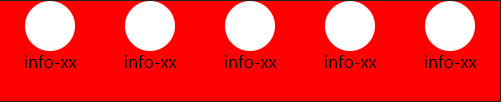

# day 05 响应式布局

* 已经学习：单独制作移动端3，基础班PC端；
* 响应式通过一份代码，三个端显示；响应不同的终端，显示不同的布局（排版）效果；


# 响应原理

* 了解响应式在学习路线中所在位置，响应式开发原理的基本实现，为学习bootstrap做好基础；

## 介绍

* 响应式布局通过同一份代码快速、有效适配手机、平板、PC设备等所有的屏幕
* 位置：手机端(单独制作)；<-----响应式（三端）----->PC(单独制作)
* 响应布局的原理：媒体查询，下面写布局不同写CSS-code出来；rem布局也有媒体查询（设置HTML 字体大小 1rem=多少px），但是rem布局更侧重于等比变化；

## 档位划分

* 媒体查询：档位划分；**市场上默认**的划分；三个节点、四个档位
  * w<768  **超小屏幕（xs : extra small）**（**手机，学习rem布局里面的档位划分都是在这个范围**）
  * 768<= w <992  **小屏设备（sm : small）**（平板）
  * 992<= w <1200  **中等屏幕（md: medium）**（桌面显示器）
  * 1200<=w  **大宽屏设备（lg: large）**（大桌面显示器）


* 语法：把市场上所有屏幕包括在内；

```css
/* 1. 超小屏幕下 xs  小于 768  布局容器的宽度为 100% */
@media screen and (min-width: 0px) {
}

/* 2. 小屏幕下 sm  大于等于768  布局容器改为 750px */
@media screen and (min-width: 768px) {
}

/* 3. 中等屏幕下 md 大于等于 992px   布局容器修改为 970px */
@media screen and (min-width: 992px) {
}

/* 4. 大屏幕下 lg 大于等于1200 布局容器修改为 1170 */
@media screen and (min-width: 1200px) {
}
```


## 版心

* 不同的档位下，版心不同；
* 档位设置：版心；
* 所有的子元素都是归于版心下，不同的版心宽度，意味着子元素要以不同的布局排版满足**用户浏览友好**的需求；
* 语法：
```css
/* 1. 超小屏幕下 xs  小于 768  布局容器的宽度为 100% */
@media screen and (max-width: 767px) {
    .container {
        width: 100%;
    }
}

/* 2. 小屏幕下 sm  大于等于768  布局容器改为 750px */
@media screen and (min-width: 768px) {
    .container {
        width: 750px;
    }
}

/* 3. 中等屏幕下 md 大于等于 992px   布局容器修改为 970px */
@media screen and (min-width: 992px) {
    .container {
        width: 970px;
    }
}

/* 4. 大屏幕下 lg 大于等于1200 布局容器修改为 1170 */
@media screen and (min-width: 1200px) {
    .container {
        width: 1170px;
    }
}
```

* 注意：
  * 媒体查询使用符号的相关：min-，max-包含等号，后面是数值单位为px；
  * 除超小屏以外：版心的宽度设置都是小于当前档位最小界值，比如 min-width: 768px，版心是750px；原因：两边留空白，用户体验好。
  * **以上市场默认划分，可根据自己需求添加档位；**


## 布局

- 不同的档位下，布局不同；

```css
/* md 中屏以上 */
@media screen and (min-width: 992px) {
      .container {
        width: 970px;
      }
      [class*="col-md-1"] {
        width: 8.333333%;
      }
      [class*="col-md-2"] {
        width: 16.666666%;
      }
      [class*="col-md-3"] {
        width: 25%;
      }
      [class*="col-md-4"] {
        width: 33.3333333%;
      }
      [class*="col-md-5"] {
        width: 41.6666666666%;
      }
      [class*="col-md-6"] {
        width: 50%;
      }
      [class*="col-md-7"] {
        width: 58.33333333333%;
      }
      [class*="col-md-8"] {
        width: 66.66666666666%;
      }
      [class*="col-md-9"] {
        width: 75%;
      }
      [class*="col-md-10"] {
        width: 83.33333333%;
      }
      [class*="col-md-11"] {
        width: 91.66666666%;
      }
      [class*="col-md-12"] {
        width: 100%;
      }
    }
```

- 多个使用类前缀会单独生效？多个使用，意味着有多个档位，若当前屏幕属于某个档位，直接该档位类前缀生效；

```css
// md档位
@media screen and (min-width: 992px) {
      .container {
        width: 970px;
      }
      [class*="col-md-1"] {
        width: 8.333333%;
      }
}

// lg 档位
@media screen and (min-width: 1200px) {
    .container {
        width: 1170px;
    }
    [class*="col-lg-1"] {
        width: 8.333333%;
    }
}
```

- 原理：媒体查询，内部设置不同的版心和类名；


#  bootstrap

* 利用 框架 bootstrap 可**非常快**地搭建出响应式页面；

## 重点

* **栅格系统**
* **响应式工具**

## 介绍

* Bootstrap 来自 Twitter（推特），是目前最受欢迎的**前端响应式**框架。翻墙；
* 网址：
  * 中文网：http://www.bootcss.com/
  * 官网：http://getbootstrap.com/
  * 推荐：http://bootstrap.css88.com/
* 框架：顾名思义就是一套架构，它有一套比较完整的网页功能解决方案，而且控制权在框架本身，有预制样式库、组件和插件。使用者要按照框架所规定的某种规范进行开发。



* 版本：
  - 2.x.x：停止维护，代码不够简洁，功能不够完善。
  - 3.x.x：目前使用最多，稳定，不支持IE6-IE7。对 IE8 支持，界面效果不好，偏向用于开发响应式布局、移动设备优先的WEB 项目。【!】
  - 4.x.x：最新版，目前还不是很流行

## 使用初始化

* 在现阶段我们还没有接触JS相关课程，所以我们只考虑使用它的样式库。

* Bootstrap 目录初始化： 


* index.html 初始化：

```html
<!DOCTYPE html>
<html lang="zh-CN">
  <head>
    <meta charset="utf-8">
    <!-- 要求 当前网页 使用 IE浏览器 最高版本的内核 来渲染 -->
    <meta http-equiv="X-UA-Compatible" content="IE=edge">
    
    <!-- 视口的设置：视口的宽度和设备一致，默认的缩放比例和PC端一致，用户不能自行缩放 -->
    <meta name="viewport" content="width=device-width, initial-scale=1">
      
    <title>Bootstrap Template</title>

    <!-- Bootstrap 的文件引入 已经有初始化文件 Normalize.css-->
    <link href="css/bootstrap.min.css" rel="stylesheet">

    <!-- HTML5 shim and Respond.js for IE8 support of HTML5 elements and media queries -->
    <!--解决ie9以下浏览器对html5新增标签的不识别，并导致CSS不起作用的问题-->
    <!--解决ie9以下浏览器对 css3 Media Query  的不识别 -->
    <!-- WARNING: Respond.js doesn't work if you view the page via file:// -->
      
    <!-- 条件注释:小于IE9的版本 -->
    <!--[if lt IE 9]>
      <script src="//cdn.bootcss.com/html5shiv/3.7.2/html5shiv.min.js"></script>
      <script src="//cdn.bootcss.com/respond.js/1.4.2/respond.min.js"></script>
    <![endif]-->
  </head>
  <body>
    <h1>你好，世界！</h1>
  </body>
</html>
```


## 布局容器

* 版心设置：Bootstrap 需要为页面内容包裹一个 .container 或者.container-fluid 容器，它提供了两个作此用处的类。
* .container：设置不同档位下的版心的宽度；
  * 超小屏（xs : extra small）：手机； 0px <=w ；版心宽度为100%
  * 小屏（sm : small） ：平板； 768px<=w  ；版心宽度定为  750px
  * 中屏（md: medium）：桌面；992px<=w ；版心宽度定为  970px
  * 大屏（lg: large）：大桌面；1200px<=w ；版心宽度定为  1170px

- .container-fluid：百分百宽度；
- 特点：
  - 所有元素为CSS3盒子模型；
  - 布局盒子有左右15pxpadding值；


## 预制类名

* 排版

```html
<h1>h1. Bootstrap heading</h1>
<h2>h2. Bootstrap heading</h2>
<h3>h3. Bootstrap heading</h3>
<h4>h4. Bootstrap heading</h4>
<h5>h5. Bootstrap heading</h5>
<h6>h6. Bootstrap heading</h6>

<p>...</p>
```

* 按钮：

```html
<a class="btn btn-default" href="#" role="button">Link</a>
<button class="btn btn-default" type="submit">Button</button>
<input class="btn btn-default" type="button" value="Input">
<input class="btn btn-default" type="submit" value="Submit">
```

* 辅助类样式：

```html
<!-- 上下文颜色 -->
<p class="text-muted">...</p>

<!-- 下拉三角 -->
<span class="caret"></span>
```

* 字体图标

```html
<span class="glyphicon glyphicon-search" aria-hidden="true"></span>
```

* 使用：
  * 拿来即用，开袋即食；
  * 修改样式：重新设置类名，注意权重问题；


## 栅格系统

* 作用：设置子元素在**不同档位下的布局；**

### 介绍

* 栅格系统，在各个档位下，控制子元素布局不同；将版心宽度均分为**12份**；
* 各个档位下都有预制好的**类前缀：**


* **类前缀：**
  - 超小屏（xs : extra small）：手机； 
  - 小屏（sm : small） ：平板； 
  - 中屏（md: medium）：桌面；
  - 大屏（lg: large）：大桌面；
* 栅格系统用于通过一系列的**行（row）与列（column）**的组合来创建页面布局，你的内容就可以放入这些创建好的布局中，控制不同的档位下，**列的子元素占有几份**


### 基本使用

* 语法：

```
<!-- 中屏和以上占有6份 -->
<div class="container">
  <div class="row">
    <div class="col-md-6">.col-md-6</div>
  	<div class="col-md-6">.col-md-6</div>
  </div>
</div>

<!-- 各个档位下，按照各个档位下布局 -->
<div class="container">
  <div class="row">
    <div class="col-md-6 col-lg-4">1</div>
  	<div class="col-md-6 col-lg-8">2</div>
  </div>
</div>
```

* 特点：
  * 单一类前缀：各个档位下的类前缀，为包括当前且向上生效；例如：.col-md-6为中屏和以上占有6份；
  * 多个类前缀：分别按照各个档位列划分生效；
  * 每个子项：默认左右15px的padding；
  * 行（.row） 可以去除父容器左右15px的padding值：.row的左右margin为-15px；


### 列嵌套

* 操作：可以在已经分好的子元素中内部，继续进行列的划分（共12份）；.
* 效果：继续在分好的布局内继续划分；
* 语法：

```html
<!-- 直接嵌套 -->
<div class="col-sm-4">
    <div class="col-sm-6">小列</div>
    <div class="col-sm-6">小列</div>
</div>

<!-- 使用row嵌套 -->
<div class="col-sm-4">
    <!-- 加1个行 row 这样可以取消父元素的padding值 而且高度自动和父级一样高； -->
    <div class="row">
         <div class="col-sm-6">小列</div>
         <div class="col-sm-6">小列</div>
    </div>
</div>
```


### 列偏移

* 操作：是划分好的子项进行列的份数偏移
* 场景：左右布局，居中布局；
* 语法：

```html
<!-- 左右对齐-->
<div class="row">
    <!-- 如果只有一个盒子 那么就偏移 = 12-4-4  -->
    <div class="col-lg-4">1</div>
    <div class="col-lg-4 col-lg-offset-4">2</div>
</div>

<!-- 居中-->
<div class="row">
     <!-- 如果只有一个盒子 那么就偏移 = (12 - 8) /2 -->
     <div class="col-md-8 col-md-offset-2">中间盒子</div>
</div>
```

### 列排序（了解）

* 操作：划分份数的子项，按照列的份数进行排序；
* 效果：左右布局改变顺序，不常用；


* 语法：

```
<!-- 列排序 -->
<div class="row">
    <div class="col-md-4 col-lg-4 col-lg-push-8"></div>
    <div class="col-md-8 col-lg-8 col-lg-pull-4"></div>
</div>
```


## 响应式工具

* 预制类名

* 可以控制子元素在档位下进行显示或隐藏；
* 语法：


* 注意：和列类前缀的参数形成对比记忆，
  * col-sm-* 是超小屏（包含）以上的屏幕都是这个份数的划分；
  * 响应式工具 只是**对当前档位下的类前缀类名生效；**


# 阿里百秀案例

* 通过bootstrap框架，熟悉实际工作中如何使用bootstrap快速进行开发

## 文件目录构建


## 初始化工作

* 设计图： 1280px 宽度；
* 宽度新增：Bootstrap 里面 container宽度 最大为 1170px，因此我们需要手动改下container宽度

```
/* 利用媒体查询修改 container宽度适合效果图宽度  */
@media (min-width: 1280px) { 
  .container { 
    width: 1280px; 
    } 
}
```

## 布局分析【!!!】

* 整体列的划分：


* 从哪个档位开始划分：中屏以上的col-md布局；另外：小屏和超小屏根据需求布局
* 策略：先布局 md以上的pc端布局，最后根据实际需求再次修改 小屏幕 和 超小屏幕的 特殊布局样式；

