## 课程介绍

- 目标
  
- 了解现阶段，我们即将要学习什么
  
- 案例对比

    - 之前做的案例都是 `单机程序`。
    - 现阶段及之后的案例都类似真正的网站

    >两个案例为什么有非常大的区别，是因为现阶段的案例使用了ajax、服务器、http等等新的技术。

## 了解上网的过程

你知道当我们在网页浏览器（browser）的地址栏中输入 URL时，页面是如何呈现的吗？

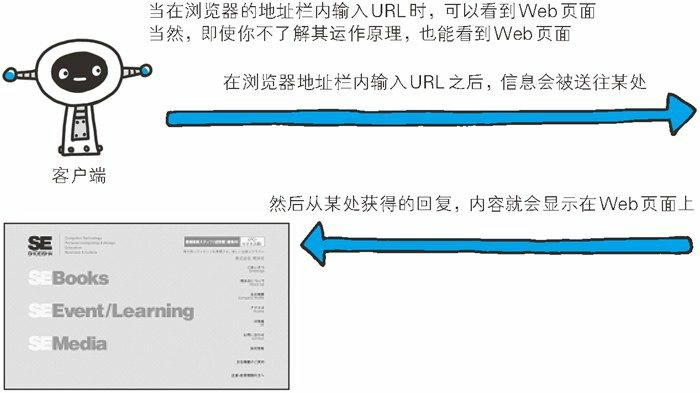

页面当然不能凭空显示出来。我们看到的页面也是像我们一样的前端人员写出来的页面，那么这些页面在哪里呢？其实先不用想的很复杂，这些页面不是我们写的，肯定不在自己的电脑上，肯定是谁写的页面就在谁的电脑上呗。

比如，老师演示的留言板页面就在老师的电脑上，百度、新浪、腾讯等公司的页面肯定也在人家的电脑上。

问题是，别人写的页面，为什么通过自己的浏览器也能看到呢？

原因是这样的，根据 浏览器地址栏中指定的URL（形如 `http://www.baidu.com/index.html`），浏览器首先根据指定的 域名^①^ (`www.baidu.com`）找到存放百度页面的计算机，向百度的计算机“索要”指定的文件（`index.html`），百度的计算机就会把index.html 中的代码返回给我们的浏览器，注意，只是把index.html中的代码返回给我们的浏览器，并不是把这个文件下载下来。浏览器刚好是一个可以显示页面的工具，所以浏览器将得到的代码解析^②^后，我们最终就看到了百度的页面了。

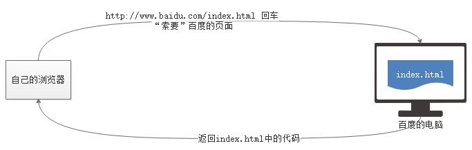

下面对上述内容中几个新知识点做一个解释：

- 域名
    - 域名的作用和IP地址一样，可以找到网络中的一台计算机
    - IP地址是标识网络设备的唯一标识，同一个网络中的计算机，IP地址绝对不会重复
- 解析
    - 这里解释的意思是，浏览器把代码（HTML、css等等代码）呈现到页面上

## 细化上网的过程

前面简单阐述了上网的过程，使用的语言大多都是大白话，接下来我们说一下上网的过程中涉及到的一些转义术语。

- 客户端
    - 在上网的过程中，浏览器还有另外一个名字，叫做客户端。

- 服务器
    - 存储百度网页的那台计算机，叫做服务器，或者叫做Web服务器。
- 请求
    - 请求，或者叫做发送请求，指的是客户端向服务器“索要”页面的过程
- 响应
    - 即回应，当客户端向服务器发送请求之后，服务器会根据客户端的请求，将客户端请求文件的源代码返回给浏览器，这一过程称之为响应。
- 资源
    - 服务器上存储的东西都可以叫做资源，比如html文件、css文件、图片文件、js文件、音频视频文件、字体文件等等。


网络请求时（上网时），必定是一端担任客户端角色，另一端担任服务器端角色

通过浏览器工具，能够查看每一次网络请求：

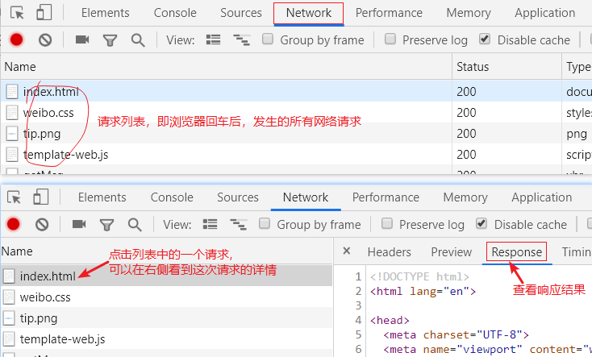

下面，我们来看一个具体的示例。

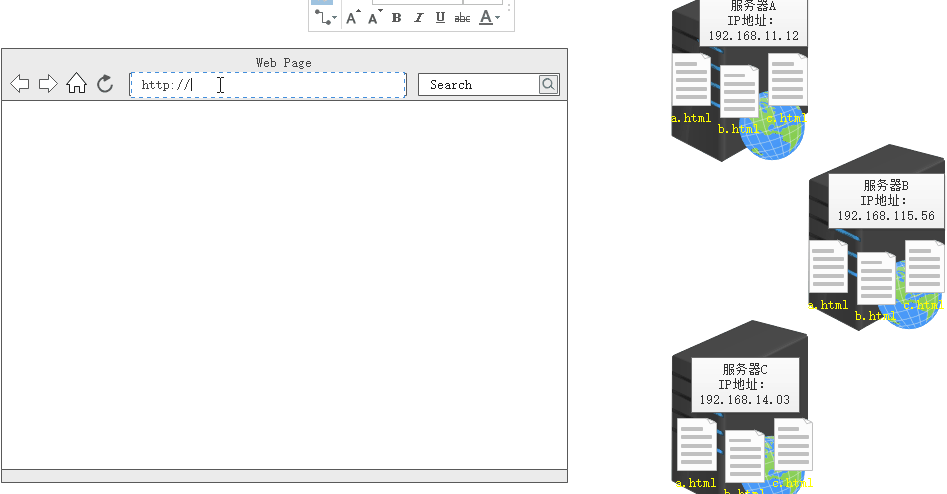

可能你每天都在使用客户端，最常见的客户端就是浏览器。浏览器一个页面时（比如http://192.168.115.56:4000/index.html），浏览器会向服务器（服务器IP地址为`192.168.115.56`）发送一个请求，服务器会去寻找客户端所期望的`index.html`，如果成功，就将`index.html`的内容及一些其他信息放在响应中发送给浏览器。最后浏览器将服务器响应的结果呈现在我们眼前。

## 了解服务器

Web资源（html文件、css文件、js文件、json文件等等...）都是存储在Web服务器上的。

Web服务器会对客户端的请求进行处理并提供响应，术语“Web服务器”可以用来表示Web服务器的软件，也可以用来表示提供Web页面的特定设备或计算机，下文都指后者。

Web服务器有着不同的风格、形状和尺寸。

服务器可以从网络运营商（阿里云、腾讯云、百度云...）租，也可以自己购买。下图是淘宝上搜索“服务器”的截图


但不管功能有何差异，所有的Web服务器都能够接收客户端的请求，将服务器端的内容回送给客户端。

总体来说，Web服务器的作用：

- 存储Web资源，资源的概念很广，这里先理解为服务器上的html文件、css文件、js文件、图片文件等等。
- 提供Web服务，理解为能够接收并处理客户端的请求，并做出回应

Web服务器和普通计算机的区别

- 除了硬件设施的区别之外，`Web服务器 === 普通计算机 + 服务器软件`

### 服务器软件

服务器和个人计算机的本质区别是，服务器上安装了服务软件。常见的服务软件非常多，比如：

- Apache
- Nginx
- IIS
- ......

凡是叫做服务器的，肯定都安装了服务软件。

我们上课使用的服务软件是使用Node编写的一个小软件，没有名字（）

> 服务器 = 计算机 + 服务软件


## 搭建Web服务环境

### 如何拥有服务器

学习阶段，无需购买服务器或租赁服务器，可以像老师一样，把自己的计算机用作服务器即可。

前面介绍到，`服务器 = 计算机 + 服务软件`

- 使用的服务器就是我们自己的计算机
- 使用的服务软件是使用Node编写的一套程序。

开机，运行服务软件，将资料中的ajax文件夹，用编辑器打开，在`app.js`上右键，选择在终端中打开，最后在出现的终端面板中，输入`node app.js`，按回车即表示服务启动了，见下图。


要点说明：

- 开启服务后，终端面板可以关闭。关闭终端面板并不表示关闭服务。
- 服务不能重复启动，否则报错。
- 我们自己创建的文件必须放到 `public` 文件夹中。
- ==访问 `public` 里面的文件，必须用访问服务器的方式去访问，即必须使用IP地址或域名访问，不能以文件方式打开==

试着访问服务器上的资源：

- 在 `public` 文件夹创建一个 html 文件，然后使用浏览器访问它

## 初识Ajax

前面我们通过浏览器输入 IP或域名，按下回车的方式，可以向服务器发送请求，并能接收到服务器响应的结果，浏览器的这项可以发送请求并接收结果的功能，可以认为是浏览器本能的行为。


Ajax是一种技术，通过这种技术，也可以实现客户端和服务器的请求响应过程。这一技术的实现，只需要浏览器执行一小段JS代码即可。

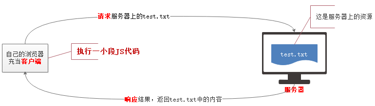

> 使用Ajax技术，无需浏览器地址栏回车、刷新等，只需要让浏览器执行一段JS代码就可以实现请求响应过程了，言外之意是使用Ajax技术，页面是不会刷新的

## 小试牛刀

接下来，我们先快速实现一次Ajax请求。

具体做法是，在 `public` 文件夹中，随便创建一个 html文件，比如叫做 `01-ajax.html` ，我们就在这个文件中写一段能够实现Ajax请求的JS代码，为了快速体验，我们可以借助于jQuery。

在 `01-ajax.html` 中，加入如下代码

```html
<script src="./assets/jquery.js"></script>
<script>
    $.ajax({
        // 属性: 值
        // url: 'http://localhost:4000/test.txt', // 请求的服务器上的资源的地址
        url: '/test.txt', // 简化的地址
        // success属性，可以接收服务器响应的结果
        success: function (result) {
            console.log(result);
        }
    });
</script>
```

浏览器，请求 01-ajax.html 即可看到Ajax请求了。

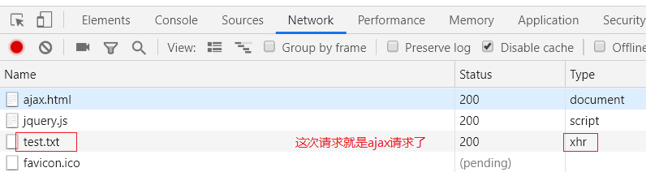

## 认识数据接口

其实，在通过Ajax向服务器发送请求的时候，不但可以请求服务器上的文件资源，也可以请求接口，url也可以这样写：

```html
<script src="./assets/jquery.js"></script>
<script>
    $.ajax({
        url: '/common/abc', // 这里这样写
        success: function (result) {
            console.log(result);
        }
    });
</script>
```

通过代码，发现，`public` 文件夹中并没有 `/common/abc` 这个文件，但是运行之后也不会报错。这种非文件的地址，我们把它叫做接口或接口地址。

- 接口，是后端同学提供的，至于如何实现，我们无需关心，那是后端同学的事。
- 接口，也是一个`网址`，通过客户端向这个网址发送请求，可以获取到接口返回的结果。

实际开发中，有很多这样的接口，也有很多提供接口的网站，下图是一个QQ号码测吉凶的接口，通过改变QQ号，接口返回对应的结果。

接口地址：http://japi.juhe.cn/qqevaluate/qq?key=55b50bf0d8b67d6659b535d138df659d&qq=295424589

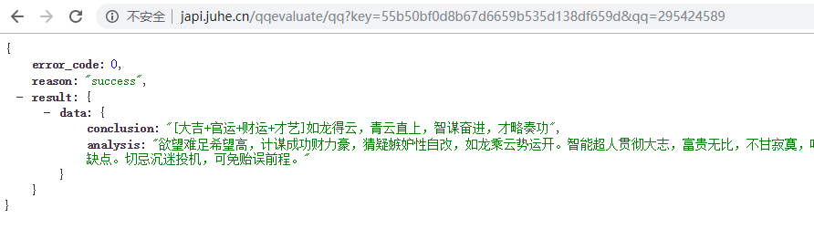

除此之外，还有很多接口，比如天气信息接口：

[https://www.tianqiapi.com/api/?appid=22449382&appsecret=Vudt9mVQ&version=v1&city=北京](https://www.tianqiapi.com/api/?appid=22449382&appsecret=Vudt9mVQ&version=v1&city=北京)

> 我们把接口看做一个带有返回值的函数即可，通过客户端访问接口，就相当于调用该函数，并可以得到它的返回值。
>
> 有些函数调用需要参数，接口也是如此。

> 对于接口的功能，一般会有一个专门的文档来介绍

## 接口文档

接口文档中记载了后端同学提供的接口的详细信息，大致包括，接口地址、作用、请求方式、请求参数、响应结果等等。

我们使用的服务器软件中也内置了很多接口，具体可以查看 `接口文档`。

向接口发送请求非常之简单，你只需要会套 `$.ajax()` 这个方法即可。

```js
$.ajax({
    type: '请求方式',
    data: '请求参数',
    url: '接口地址',
    dataType: '响应数据类型',
    success: function (res) {
        // res 就是响应结果
    }
});
```

接口参数可以按下面两种方式来填写，哪一种写法都可以：

- 方式一：`参数=值&参数=值...`
- 方式二：`{参数: 值, 参数: 值, ...}`

> 小知识点，请求参数是客户端额外发送到服务器的数据，告知服务器此次请求的具体信息
>
> 无论使用哪种写法编写请求参数，实际发送到服务器的总是方式一那样的字符串

## 接口应用，完成验证用户名案例

在上网注册的时候，经常会遇到验证用户名是否存在的情况。比如下面图示的是[博客园的注册页面](https://account.cnblogs.com/signup)验证用户名的场景。

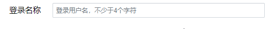

我们也可以使用自己的 `/common/checkUser` 接口，完成这样的验证。

> 注意，接口文档告诉我们了，zhangsan、lisi、wangwu 三个用户名已经注册过了

实现过程分析：

- 不再是刷新页面就发送Ajax请求了，应该在input失去焦点时，发送验证用户名的Ajax请求
- 需要验证的用户名不能写死，应该是用户在文本框中输入的值
- 服务器返回的结果，不应该直接console.log了，应该判断后，在页面中给出提示

具体代码：

```html
<input type="text" id="username">
<span></span>

<script src="./assets/jquery.js"></script>
<script>
    // 1. 注册 input的失去焦点事件
    $('input').blur(function () {
        var uname = $(this).val(); // 获取输入框中的值
        // 2. 发送ajax请求，验证用户名
        $.ajax({
            type: 'GET',
            url: '/common/checkUser',
            data: {username: uname},
            // data: 'username=' + uname, // username=xxx
            dataType: 'json',
            success: function (result) {
                console.log(result);
                // 3. 在span标签中给出提示
                $('span').text(result.msg);
            }
        });
    });
</script>
```


## 案例--留言板

### 发送Ajax请求，获取所有的留言

1. 准备工作
    1. 将 `Ajax阶段资料/03-发布微博网页模板（Ajax案例使用）` 中的 `weibo.html`及`css`、`images`文件夹拷贝到`public`文件夹中。
    2. 浏览器访问 localhost:4000/weibo.html，能够看到初始页面。
2. 按照接口文档，套 $.ajax() 方法

### 将数据渲染到页面中

1. 渲染
    1. 就是把从服务器获取的数据，放到页面上显示
2. 具体做法
    1. 将从服务器获取的数据（变量result）循环
    2. 循环过程中，拼接 `li` 标签
    3. 循环之后，把拼接好的所有 `li` 放到 `ul` 中即可

### 单击按钮，实现发布留言

1. 为按钮注册单击事件
2. 事件处理函数中，获取输入框的值（留言人的名字和内容）
3. 按照接口文档，套 $.ajax() 方法
4. 添加留言成功后，让页面显示新的留言
    1. 将前面获取留言的代码封装成函数。
    2. 添加成功之后，调用函数，从新获取数据。
5. 清空输入框的值

## $.ajax() 方法的详解

### type

1. 意义
    - 表示请求的方式或方法（method）
2. 最常见的两种请求方式
    - GET
    - POST
3. GET和POST的异同
    - 不同点：
        - get  ：获取，得到。这种方式请求用于向服务器请求资源（图片，文件，数据....）。它是最常见的请求方式。它的重点在于，它只是请求，而`不会改变`服务器上的资源。
        - post：派送，投递。这种方式的请求用于向服务器上提交数据，它的重点在于，它`可能会修改`服务器上的资源。
    - 相同点
        - get和post请求都可以在发请求时附带一些数据。例如：根据用户名去检查这个用户是否被占用；在论坛中注册一个账号。
        - get和post请求都能够从服务器上获取返回的数据。

> 实际开发中，接口都是后端同学提供的，所以接口支持哪种请求方式，还得以文档为准。

### data

1. 意义
    - 向接口发送请求的时候，携带的数据，也就是接口文档中的请求参数
2. 写法
    - 对象形式，形如： `{name: 'xxx', content: 'xxx'}`
    - 字符串形式，形如： `name=xxx&content=xxx`

> 无论写法如何，实际上发送给服务器的数据都是 字符串形式。多个请求参数之间，使用 & 符号隔开。GET请求的时候，这个字符串和接口之间使用 ? 隔开

### dataType

1. 意义
    - 服务器响应数据的格式。
    - 指定该项，jQuery会自动将服务器响应的数据处理成JS数据（数组、对象、字符串、布尔等等）
2. 可选的值
    - `json`，它是==最最常见==的数据传输格式。能够以简单的语法表示复杂的数据
    - `text`，表示服务器返回的是文本类型的数据
    - `xml`，表示服务器返回的是xml格式的数据，目前项目中很少使用它了，这里作为了解
    - `jsonp`、`script`、`html`等其他值

> 当我们已经知道了服务器返回数据的格式，则最好指定 `dataType`

### beforeSend

1. 意义

    - 在发送Ajax请求之前，允许我们做一些事情

2. 语法

    ```js
    $.ajax({
        beforeSend: function () {
            // 发送请求之前，你需要做什么？可以写到这里
        }
    });
    ```

### complete

1. 意义

    - 在Ajax请求结束之后，允许我们做一些事情

2. 语法

    ```js
    $.ajax({
        complete: function () {
            // Ajax请求结束了，你想做什么？可以写到这里
        }
    });
    ```

## 原生的Ajax请求

在实际的开发中，我们会直接使用如jquery这样的第三方工具库来调用ajax，而不会自己去手写一个原生的。但对于学习者来说，深入学习原生ajax能帮助我们更好的理解和掌握 。

原生的Ajax实现，是基于浏览器内置对象 `XMLHttpRequest` 提供的API实现的。

### 基本语法

1. GET方式写法

    ```js
    // 1. 实例化 XMLHttpRequest对象
    var xhr = new XMLHttpRequest();
    // 2. 通过 open(请求方式, url) 方法，设置请求方式和url
    xhr.open('GET', '/common/time');
    // 3. 调用 send() 方法，发送请求。 ---> 此步骤，表示开始发送请求
    xhr.send();
    // 4. 准备一个事件，当请求响应过程结束后，会触发该事件；在事件处理函数中，接收服务器响应的结果
    xhr.onload = function () {
        // 使用 xhr.response; 来接收结果
        console.log(xhr.response);
    }
    ```

    如果有请求参数

    ```js
    xhr.open('GET', '接口地址?参数=值&参数=值....');
    ```

    

2. POST方式写法

    和GET请求相比，多了一行代码，并且请求参数的位置变化了。

    ```js
    var xhr = new XMLHttpRequest();
    xhr.open('POST', '/message/addMsg');
    // 相比GET方式，POST方式多下面一行代码
    xhr.setRequestHeader('Content-Type', 'application/x-www-form-urlencoded');
    xhr.send('name=李白&content=举杯邀明月');
    xhr.onload = function () {
        console.log(xhr.response);
    }
    ```

### 原生ajax中get 和 post 区别

- get
    - 参数拼接在url（`url?name=1&age=30`）
    - 由于浏览器对url长度的支持（各个浏览器均不同）是有限，所以，它只能附加少量的数据。
- post
    - 要设置请求头: `xhr.setRequestHeader('content-type','application/x-www-form-urlencoded')`
    - 参数写在send()方法中:`send('name=1&age=30')`
    - 相对于get 来说，没有传参大小的限制。

### 用原生的Ajax实现验证用户名案例

实现代码：

```js
document.getElementById('username').onblur = function () {
    // 0. 获取输入框的值
    var uname = this.value;
    // 1. 实例化 XMLHttpRequest对象
    var xhr = new XMLHttpRequest();
    // 2. 通过 open(请求方式, url) 方法，设置请求方式和url
    xhr.open('GET', '/common/checkUser?username=' + uname);
    // 3. 调用 send() 方法，发送请求。 ---> 此步骤，表示开始发送请求
    xhr.send();
    // 4. 准备一个事件，当请求响应过程结束后，会触发该事件；在事件处理函数中，接收服务器响应的结果
    xhr.onload = function () {
        // 使用 xhr.response; 来接收结果
        console.log(xhr.response);
    }
}
```

> 课后，大家可以把留言板案例也用原生的ajax写一写。

### 浏览器中的小问题

#### readyState 和 onreadystatechange

既然Ajax请求是一个耗时操作，也就是从开始创建 xhr 对象，然后调用open、调用send发送请求到服务器（耗时）、·（耗时）、接收服务器返回的数据、完全接收到服务器返回的数据，这一整个过程是耗时的操作，即使网速再快也需要一定的时间。

换句话说，在执行Ajax请求响应过程中，要经过好几个阶段，xhr 对象提供了一个属性 readyState ，用它来表示 Ajax请求到哪个阶段了。

输出 xhr.readyState 会得到 0、1、2、3、4几个数字，他们分别表示 Ajax请求响应的各个阶段，每个数字表示的意思如下：

| readyState | 状态描述         | 说明                                                         |
| ---------- | ---------------- | ------------------------------------------------------------ |
| 0          | UNSENT           | 代理（XHR）被创建，但尚未调用 `open()` 方法。                |
| 1          | OPENED           | `open()` 方法已经被调用，建立了连接。                        |
| 2          | HEADERS_RECEIVED | `send()` 方法已经被调用，并且已经可以获取状态行和响应头。    |
| 3          | LOADING          | 响应体（服务器返回的数据）下载中， `responseText` 属性可能已经包含部分数据。 |
| **4**      | **DONE**         | **响应体（服务器返回的数据）下载完成，可以直接使用 `responseText`或response 获取完整的结果。** |

> 一般都不说Ajax请求响应的几个阶段，大多数都说Ajax的几个状态，也就是说readyState表示Ajax请求过程中的几个状态。

------

接下来我们，再看一下onreadystatechange事件。

onload是H5之后新增的事件，在H5之前，都是使用onreadystatechange。

on... 表示一个事件，翻译过来就是“当...时候”，readystate前面说过，是一个数字，表示ajax的状态，change是改变的意思。所以这个事件的意思是，当Ajax状态发生变化的时候，就会触发这个事件。

```js
var xhr = new XMLHttpRequest()；
// 创建对象后，先打印一次XHR对象的状态，此时状态值为0
console.log(xhr.readyState); // 0

// 添加事件onreadystatechange，每当XHR对象的状态发生变化的时候，就会触发这个事件
// 比如
// xhr对象的状态从0-->1，会触发下面的事件
// xhr对象的状态从1-->2，会触发下面的事件
// xhr对象的状态从2-->3，会触发下面的事件
// xhr对象的状态从3-->4，会触发下面的事件
xhr.onreadystatechange = function () {
    console.log(this.readyState); 
    // 输出1/2/3/4
}
// open 方法的第一个参数的作用就是设置请求的 method
xhr.open('POST', '/query-post')
// 设置 Content-Type 为 application/x-www-form-urlencoded，这行代码不用死记硬背，去复制即可
xhr.setRequestHeader('Content-Type', 'application/x-www-form-urlencoded')
// 需要提交到服务端的数据可以通过 send 方法的参数传递
// 格式：name=zhangsan&age=18
xhr.send('name=zhangsan&age=18');
```

------

如果服务器返回的数据量非常大，xhr对象是分块接收数据的，一次性接收一部分（大小不确定），直至接收完毕为止。

注意的是，当xhr对象接收的数据发生变化的时候，这里readyState的值不会发生变化，一直为3，但接收到的数据变化了，也表示ajax的状态变化了，此时也会触发onreadystatechange事件。

```js
var xhr = new XMLHttpRequest()；

xhr.onreadystatechange = function () {
    conso.log('数据：' + this.responseText.length); // 数据非常长，输出它的长度看效果即可
    console.log('Ajax状态：' + this.readyState);  // 3表示正在接收数据，最后一次4表示接收完毕
}
// 这里调用 /big-data 接口，它返回100万次时间戳
xhr.open('GET', '/big-data')
xhr.send()；
```

#### IE中的缓存问题(了解)

- 只有IE浏览器会有缓存问题，所以作为了解内容
- 缓存问题指的是：两次或多次 AJAX GET 请求**同一个** URL ，IE浏览器在第二次请求的时候，并不会从新向服务器发请求，而是直接使用上次请求的结果。

```html
<body>

    <input type="button" id="btn" value="请求">

    <script>
        // 点击按钮的时候，发送ajax请求
        document.getElementById('btn').onclick = function () {
            // 1. 创建 XHR 对象
            var xhr = new XMLHttpRequest();
            // 2. 调用open方法，设置请求方式和url（接口）
            // xhr.open('GET', 'http://127.0.0.1:4000/time');
            // xhr.open('GET', '/time?abc=' + Math.random());
            xhr.open('GET', '/time?abc=' + Date.now());
            // 3. 调用send方法，发送请求
            xhr.send();
            // 4. 当请求响应过程结束，才接受服务器响应的结果
            xhr.onload = function () {
                // console.log(xhr.response);
                console.log(this.response);
            }
        }
    </script>
</body>
```

- 解决方案

> 让每次请求的URL都不同
>
> 不同的查询字符串(请求参数)会被浏览器认为是不同的地址，浏览器会忽略客户端缓存。

```javascript
var xhr = new XMLHttpRequest()
xhr.open('GET', '/time?t=' + Date.now())
xhr.send(null)
xhr.onload = function () {
  console.log(this.responseText)
  // =>
}
```

### 其他API

#### 创建XHR对象的兼容方案

XMLHttpRequest 在老版本浏览器（IE5/6）中有兼容问题，可以通过另外一种方式代替。

```javascript
var xhr = window.XMLHttpRequest ? new XMLHttpRequest() : new ActiveXObject('Microsoft.XMLHTTP')
// xhr 的成员相同，即后续的open、send方法一样使用、onreadystatechange
```

#### responseType

`responseType`，表示预期服务器返回的数据的类型，当设置了该属性后，通过 `response` 接收数据的时候，会根据该属性的值来自动处理结果为JS能够识别的数据。

> 很简单，它相当于 $.ajax() 方法中的 dataType，这回你明白了吗？

比如，当设置了 `responseType='json'`  后，使用 `response` 来接收服务器返回的数据时，会自动处理 JSON 数据为 JS 数组，免去了 `JSON.parse()` 这一步。

responseType的可选值为下面几个：

- “”  -- 空，表示文本，和text一样。空为默认值
- text -- 文本
- json -- JSON格式数据
- document -- 文档对象。当服务器返回的结果是XML类型的时候，需要指定为document

```js
var xhr = new XMLHttpRequest();
xhr.onload = function () {
    // 因为指定了responseType为json。所以ajax会自动将服务器返回的结果当做json来处理
    // 会自动调用JSON.parse来将结果处理成JS数据
    console.log(this.response);
}
xhr.open('GET', '/getMsg');
// send之前，指定预期服务器返回数据的类型
xhr.responseType = 'json'; // 可选的值 '' 、 text 、 json 、 document
xhr.send();
```


### 原生Ajax小结

至此，我们学习了很多 XHR 对象的 属性和方法 （统称API）。其实这些API分属不同的XHR版本。

- XHR 1 版 API -- 最初的XHR对象提供的API，基本上兼容所有的浏览器
    - open -- 设置请求方式、请求url、同步或异步
    - send -- 发送请求
    - readyState -- ajax的状态，值（0，1，2，3，4）
    - onreadystatechange -- 当readyState的值改变的时候，或当接收的数据发生改变的时候都会触发
    - responseText：-- 用于接收服务器返回的 `文本类型` 的结果
- XHR 2.0 新增API，基本上不再支持IE6、IE7、IE8
    - onload（2014年新增） -- 当请求响应成功了，会触发
    - onprogress -- 当响应的数据，正在接收中，会触发。数据量比较大的话，可能会触发多次，可以使用它做一个进度条
    - onloadstart -- 当请求开始的时候，会触发
    - onloadend -- 当请求结束的时候，会触发
    - response ：可以接收任何的响应结果
    - responseType（2012年新增）：配合response使用的一个属性

> 实际开发中，原生的Ajax使用的概率非常少。一般都使用封装好的库，比如 jQuery中的 $.ajax()


## 同步和异步

### 异步操作

这是ajax这部分的一个难点。

异步指的是一段耗时的JS代码在执行时不会阻塞后续代码的执行。

看一个例子：

```js
// 执行一个输出
console.log(111);

// 一个耗时的定时器
setTimeout(function () {
    console.log(333);
}, 2000);

// 再执行一个输出
console.log(222);
```

执行上面的代码，输出结果是怎样的呢？答案很简单，先输出111、然后输出222、最后输出333。

为什么呢？因为定时器是一个耗时操作，而且定时器之后的代码==不需要==等待定时器执行完毕才执行。==这就是一个异步操作==。

我们来画一个时间轴，来深层次的看一下异步操作。

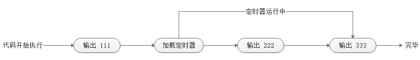

从图中不难发现，`定时器` 和 `输出222` 在某个时间点同时运行了。

==所以异步操作的**本质**是同一个时间点，有多个操作同时执行了；耗时操作（定时器）并不会阻塞后面代码的执行。==

- 同一个时间点，执行了多个操作
- 耗时操作不会阻塞后续代码的执行

我们所说的Ajax也是一个耗时操作，因为从发送请求开始（调用send方法），该请求就去服务器请求资源去了，直到完全接收到服务器响应的结果，这一过程肯定需要一定的时间。

那么如果把定时器的代码换成Ajax的代码，输出结果是怎样的呢？

```js
// 执行一个输出
console.log(111);

// 中间是一个耗时的ajax请求
var xhr = new XMLHttpRequest();
xhr.open('GET', '/common/time');
xhr.send();
xhr.onload = function () {
    console.log(333);
}

// 再执行一个输出
console.log(222);
```

答案和前面一样，也是先输出111、然后输出222、最后输出333。==这说明上面的ajax请求也是一个异步的操作==。

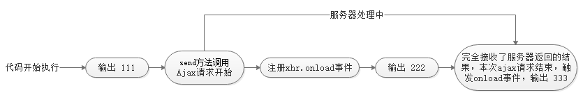


> 异步操作在JS中非常常见，后面的学习及工作中会大量遇到，当然大牛们也提出了很多处理异步的方案，我们后续会继续讲解。

### 同步操作（了解）

既然异步操作指的是在同一个时间点可以同时执行多个操作，那么==**同步操作**指的就是在同一个时间点只能执行一个操作==。

我们学习的Ajax请求，不但可以写成异步请求，也可以写成同步请求，请看下面的代码：

```js
// 执行一个输出
console.log(111);

// 中间是一个耗时的ajax请求
var xhr = new XMLHttpRequest();
xhr.open('GET', '/common/time', false);
xhr.onload = function () {
    console.log(333);
}
xhr.send();

// 再执行一个输出
console.log(222);
```

上面的代码的 open 方法发生了变化 `xhr.open('GET', '/common/time', false)`  ，多了第三个参数`false`。 执行的结果是，先输出111、然后输出333、最后输出222.

上述代码就是一个同步请求，Ajax请求代码阻塞了后续代码（`console.log(222)`）的执行，只有Ajax请求响应过程结束，后续代码才会执行，同一个时间点只能有一个操作执行，这就是同步请求。

我们还是画一个时间轴：

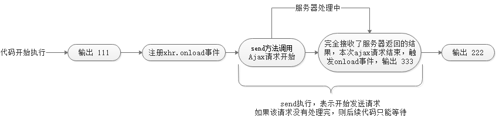

> 这里有一个小细节，onload事件放到了send之前了，否则onload事件也会被send阻塞

> 实际开发中，基本上都是异步操作，所以这里的同步操作了解即可。

## 封装ajax函数

前面发送ajax请求的时候，总是要写大量重复的代码，用起来非常麻烦，为了简化ajax的使用，自己封装一个函数。

> 函数就可以理解为一个想要做的事情，函数体中约定了这件事情做的过程，直到调用时才开始工作。

```javascript
/*
        封装一个函数
        1. 能够发送GET和POST方式的请求
        2. 发送请求的时候，可以给服务器传递参数
        3. 能够给不同的url发送请求
        4. 服务器返回的结果，应该由调用函数的人自行处理
        */

        function ajax(type, url, data, cb) {
            var xhr = new XMLHttpRequest();

            // 判断，如果是GET请求，让url和data拼接到一起
            if (type === 'GET') {
                url = url + '?' + data; // /query-get?id=11&age=22&name=zs
                data = null;
            }

            xhr.open(type, url);

            // 判断，如果是POST方式，需要加请求头
            if (type === 'POST') {
                xhr.setRequestHeader('Content-Type', 'application/x-www-form-urlencoded');
            }

            xhr.send(data);

            xhr.onload = function () {
                // console.log(this.response);
                cb(this.response);
            }
        }

        // JS 中，函数不调用不执行。可以写一个函数，用它来处理服务器返回的结果
        
        // 调用函数，测试
        ajax('POST', '/query-post', 'id=11&age=22&name=zs', function (x) {
            console.log(x);
        });

        /* $.get('/adf', 'id=22', function (res) {
            console.log(res);
        }); */

        ajax('GET', '/query-get', 'id=11&age=22&name=zs', function (res) {
            alert(res);
        });
```


## FormData对象

Date() -- 日期

Data -- 数据 

FormData是h5中新增的一个内置对象。

FormData对象用以将数据编译成键值对，以便用`XMLHttpRequest`来发送数据。其主要用于发送表单数据，但亦可用于发送带键数据(keyed data)，而独立于表单使用。

以前 AJAX 操作只能提交字符串，现在可以提交 **二进制** 的数据

- 使用方法一（有form表单）

    ```html
    <form id="fm">
        <input type="text" name="user"><br>
        <input type="password" name="pwd"><br>
        <input type="radio" name="sex" value="男" checked>男
        <input type="radio" name="sex" value="女">女<br>
        <input type="file" name="pic"><br/>
        <input type="button" id="btn" value="提交">
    </form>
    
    <script>
        // 当点击提交按钮的时候，需要把表单各项的值，提交给fd接口。
            document.getElementById('btn').onclick = function () {
                // 获取各项值
                /* var user = document.getElementsByName('user')[0].value;
                var pwd = document.getElementsByName('pwd')[0].value; */
    
                // FormData 专门用于收集表单各项值
                // 1. 有表单，找到表单
                var form = document.getElementById('fm');
                // 2. 实例化FormData，将表单的DOM对象传入即可
                var fd = new FormData(form); // fd对象中包含了表单所有的值
    
                // 将各项值发送给fd接口
                var xhr = new XMLHttpRequest();
                xhr.open('POST', '/fd');
                // xhr.setRequestHeader('Content-Type', 'application/x-www-form-urlencoded');
                xhr.responseType = 'json';
                xhr.send(fd);
                xhr.onload = function () {
                    console.log(this.response);
                }
            }
    </script>
    ```

    ==上述使用FormData的时候，form表单中的各项必须有name属性。没有name属性是收集不到数据的==

- 使用方法二（没有form表单）

    ```php+HTML
    <input type="text" id="user"><br>
    <input type="password" id="pwd"><br>
    <input type="file" id="pic"><br/>
    <input type="button" id="btn" value="提交">
    
    <script>
        // 点击提交按钮的时候，把数据发送给fd接口
            document.getElementById('btn').onclick = function () {
                // 收集表单数据
                // 1. 先实例化FormData
                var fd = new FormData();
                // 2. 调用FormData内置的方法append，向fd对象中，添加值
                // fd.append(key, value);
                fd.append('username', document.getElementById('user').value);
                fd.append('pwd', document.getElementById('pwd').value);
                // 如果是文件的话，必须使用文件对象
                var file = document.getElementById('pic');
                // console.dir(file);
                var fileObj = file.files[0];
                // fd.append('myfile', 文件对象);
                fd.append('myfile', fileObj);
    
                var xhr = new XMLHttpRequest();
                xhr.open('POST', '/fd');
                xhr.responseType = 'json';
                xhr.send(fd);
                xhr.onload = function () {
                    console.log(this.response);
                }
            }
    </script>
    ```

jQuery中使用FormData：

```html
	<form id="fm">
        <input type="text" name="user"><br>
        <input type="password" name="pwd"><br>
        <input type="radio" name="sex" value="男" checked>男
        <input type="radio" name="sex" value="女">女<br>
        <input type="file" name="pic"><br />
        <input type="button" id="btn" value="提交">
    </form>

    <script src="/jquery.js"></script>
    <script>

        $('#btn').click(function () {
            var fm = $('#fm');
            var fd = new FormData(fm[0]); // 这里fm必须是DOM对象
            console.log(fd);

            $.ajax({
                type: 'post',
                url: '/fd',

                // 如果data使用的是对象，ajax方法会把对象转成字符串，
                // 即把{name: 'zs', age: 18}转成name=zs&age=18
                // data: {name: 'zs', age: 18}, 
                data: fd,
                // processData: false, 表示不让jQuery把fd对象转成字符串，而是直接发送fd对象
                processData: false,
                // contentType：false，表示不让jQuery去设置content-type，让FormData去处理
                contentType: false,
                success: function (res) {
                    console.log(res);
                }
            });
        });


        // xhr.send('name=zs&age=18');

    </script>
```


参考链接：

https://developer.mozilla.org/zh-CN/docs/Web/API/FormData/Using_FormData_Objects

## 模板引擎

### 模板引擎介绍

客户端中拿到请求的数据过后最常见的就是把这些数据呈现到界面上。

如果数据结构简单，可以直接通过字符串操作（拼接）的方式处理，但是如果数据过于复杂，字符串拼接维护成本太大，就不推荐了。

> 模板引擎：
>
> - artTemplate：https://aui.github.io/art-template/

模板引擎实际上就是一个 API，模板引擎有很多种，使用方式大同小异，目的为了可以更容易更高效的将数据渲染到HTML字符串中。==通俗的说，模板引擎的目的就是将服务器返回的数据显示到HTML页面中==。

### 使用模板引擎步骤

1. 准备一个存放数据的盒子（不是必须的，使用body也可以）

2. 引入template-web.js文件

3. 定义模板（具体语法可以去官网查看），一定要指定script的id和type属性

4. 调用template函数，为模板分配数据，template函数有两个参数一个返回值

    1. 参数1：模板的id
    2. 参数2：分配的数据，必须是一个JS对象的形式
    3. 一个返回值：是数据和模板标签组合好的结果

5. 将 “拼接” 好的结果放到准备好的盒子中（不是必须的，console出来也可以看结果）

    

```html
<!-- 使用模板引擎-1.加载js文件 -->
<script src="./assets/template-web.js"></script>

<!-- 使用模板引擎-2.设置模板 -->
<script id="test" type="text/html">
        <h1>{{title}}</h1>
</script>

<script>
    // 使用模板引擎-3.调用template函数
    // var 模板和数据组合好的结果 = template(模板id, 模板中使用的数据必须是js对象类型);
    var data = {
        title: '这是模板引擎的例子'
    };
    // “拼接”
    // 调用插件提供的方法template。将数据和模板组合起来。
    var html = template('test', data);
    console.log(html);
    /*
        <h1>这是模板引擎的例子</h1>
        */
    document.body.innerHTML = html;

</script>
```

> 定义模板时的script标签一定好指定id和type
>
> tempalte函数语法：var html = template(模板id,  Object);

### 模板语法

- 输出普通数据（字符串、数值等）

    ```
    // 模板写法
    {{var}}
    
    // template函数写法
    var html = template('id', {
        var: 'hello world'
    });
    ```

- 条件

    ```
    // 模板写法
    {{if age > 18}}
    	大于18
    {{else}}
    	小于18
    {{/if}}
    
    // template函数写法
    var html = template('id', {
        age: 20
    });
    ```

- 循环

    ```
    // 模板写法
    {{each arr}}
    	{{$index}} -- 数组的下标
    	{{$value}} -- 数组的值
    {{/each}}
    
    // template函数写法
    var html = template('id', {
        arr: ['apple', 'banana', 'orange']
    });
    ```

完整的代码：

```html
<script src="./assets/template-web.js"></script>

    <!-- 1. 定义模板 -->
    <script id="abc" type="text/html">
        <h1>{{name}}</h1>
        <p>我是{{nickname}}，我有一辆{{car}}，我今年{{age}}岁了</p>
        {{if age >= 18}}
            <p>欢迎来玩~</p>
        {{else}}
            <p>未成年人禁止进入</p>
        {{/if}}
        <p>我有好几个女朋友，分别是：</p>
        <ul>
            {{each girls}}
            <li>{{$index}} -- {{$value}}</li>
            {{/each}}
        </ul>
    </script>


    <script>
        // 2. 调用template函数
        var str = template('abc', {
            name: '狗哥',
            nickname: '北狗最光阴',
            car: '宝马',
            age: 31,
            girls: ['王婆', '金莲', '西门大官人', '李师师', '赛金花']
        });

        console.log(str);
        document.body.innerHTML = str;
    </script>
```


### 案例中使用模板引擎处理响应数据

下面以留言板案例为例。

```html
<!-- 引入template-web.js -->
<script src="./assets/template-web.js"></script>

<!-- 定义模板 -->
<script id="moban" type="text/html">
    {{each girls}}
    <li class="media">
      
      <div class="media-body">
        <h4>{{$value.name}}</h4>
        <p>{{$value.content}}</p>
    </div>
    </li>
    {{/each}}
</script>
```

```js
xhr.onload = function () {
    // console.log(this.response);
    var data = JSON.parse(this.response);
    console.log(data);
    // 拼接字符串
    var str = template('moban', {
        girls: data
    });
    // 把变量后，拼接好的str放到 id为 messages 的ul中
    document.getElementById('messages').innerHTML = str;
}
```


## Ajax综合案例

### 用到的接口列表

- 参见接口文档

### 实现会员列表功能

复制资料中的`index.html` 、`add.html` 、`detail.html` 三个文件到public文件夹。

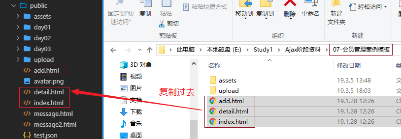


1. 页面加载，发送Ajax请求到对应的接口`/member/list-page`，获取6个会员
2. 将响应数据渲染到页面中

- ajax代码

```js
/////////////////////////////////////////////////////////////
// 页面刷新，获取6个会员
$.ajax({
    type: 'GET',
    url: '/member/list-page',
    data: { page: 1 },
    dataType: 'json',
    success: function (res) {
        console.log(res);
        // 1、定义空字符串，用于保存所有的会员
        var str = '';
        // 2. 遍历res，拼接空字符串
        res.forEach(function (item) {
            str += `<div class="col-lg-4 col-md-6">
                    <div class="card mb-4">
                    <div class="card-img-top py-4 bg-dark text-center">
                    
                    <h3 class="card-title text-light">${item.name}</h3>
                    </div>
                    <div class="card-body">
                    <p class="card-text">${item.bio}</p>
                    <a href="detail.html?id=${item.id}" class="card-link">View</a>
                    <a href="#" class="card-link text-danger" data-id="${item.id}">Delete</a>
                    </div>
                    </div>
                    </div>`;
        });
        // 3. 遍历之后，得到了所有会员，把字符串放到id为members的div中
        $('#members').append(str);
    }
});
```


### 实现查看会员详细信息


1. 点击 “View” 超链接，跳转到 `/detail.html` ，跳转时**一定要携带**该会员的id

    ```html
    <!--index.html页面中，渲染页面的时候，给每个View都挂这个超链接-->
    <a href="detail.html?id=${item.id}" class="card-link">View</a>
    ```

2. 点击View，会跳转到detail.html中，并且还带有id参数

    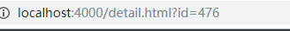

3. 到detail.html中，获取地址栏的id值

    ```js
    // var id = location.search;  // ?id=498
    var id = location.search.replace(/\D/g, ''); // 482
    ```

4. `detail.html` 中获取到会员id后，调用接口`/member/detail`获取该会员的信息

5. 将获取到的信息展示在页面中

下面是完整的代码

```js
var id = location.search.replace(/\D/g, ''); // \d 表示数字  \D 表示非数字
// console.log(id);
// 2. 套用接口，获取当前会员的详细信息
$.ajax({
    type: 'GET',
    url: '/member/detail',
    data: {id: id},
    dataType: 'json',
    success: function (res) {
        // console.log(res)
        $('.img-thumbnail').attr('src', res.avatar);
        $('h1').text(res.name);
        $('.lead').text(res.bio);
    }
});
```


### 实现删除会员功能

1. 点击超链接不能跳转，设置href属性为javascript:; 或 阻止标签的默认行为

2. 使用事件委托的方式来注册单击事件（给body注册单击事件，委托给 delete标签）

3. 提示是否要删除（因为删除是敏感操作，必须要提示）

4. 在delete标签上设置自定义属性 data-id ，值就是当前这个会员的id

    ```html
    <a href="#" class="card-link text-danger" data-id="${item.id}">Delete</a>
    ```

5. 调用接口 `/member/delete` ，并携带id参数，完成删除

6. 删除成功后，将当前的会员移除掉即可

```js
//////////////////////////////////////////////////////////////
// 1. 给 删除 注册单击事件
$('body').on('click', '.text-danger', function (e) {
    e.preventDefault();
    // 2. 询问是否要删除
    var a = confirm('你确定要删除吗'); 
    // 对于confirm函数，用户点击确定，返回true；用户点击取消，返回false
    // console.log(a);
    if (!a) {
        return;
    }
    // 3. 获取当前会员的id（id在被点击的元素的data-id属性上）
    var id = $(this).attr('data-id');
    var that = $(this);
    // console.log(id);
    // 4. 调用接口，完成删除
    $.ajax({
        type: 'POST',
        url: '/member/delete',
        data: { id: id },
        dataType: 'json',
        success: function (res) {
            console.log(res); // {message: "数据删除成功"}
            if (res.message === '数据删除成功') {
                // 5. 删除成功，把当前会员移除掉即可
                that.parents('.col-md-6').remove();
            }
        }
    });
});
```


### 实现新增会员功能

1. 点击index.html中的“New Member”超链接，跳转到add.html

    ```html
    <a href="/add.html" class="btn btn-primary my-2">New member</a>
    ```

2. 新增会员,图片预览功能。

- 图片预览

    - input:file 标签属性介绍

        - accept：限制上传文件的文件类型
            - accept=".jpg,.png,.gif"       一个一个后缀指定
            - accept="image/*"    表示允许任何的图片类型
        - multiple：多选

    - 如何实现图片预览

        - 获取文件的dom对象 `var fileObj = this.files[0]`;
        - 使用h5新增对象URL.createObjectURL(fileObj)，创建临时图片地址，用于预览
        - 设置预览图片的src属性为临时图片地址

        ```js
        // 根 #input_avatar 添加 change 事件，当文件域的内容发生变化的时候，会触发
        $('#input_avatar').change(function () {
            // 完成文件预览功能
            // 1. 找到文件对象
            var fileObj = this.files[0]; // 文件对象，直接使用this，因为this是DOM对象
            // 2. 使用URL.createObjectURL方法，可以为图片临时生成一个连接，通过这个链接可以查看到图片
            var url = URL.createObjectURL(fileObj);
            // console.log(url);
            // 3. 设置预览图片的src属性为上面的链接即可
            $('.img-thumbnail').attr('src', url);
        });
        ```
        

- 提交 FormData

    > 注意事项：添加会员接口需要的三个参数分别为 name / bio / avatar
    >
    > 表单中的input需要设置name值，否则FormData是收集不到数据的
    >
    > name值要和接口指定的参数对应。否则不能添加成功

    ```js
    // 二、完成添加会员
    $('.btn-block').click(function (e) {
        e.preventDefault(); // 阻止默认行为，不允许表单提交，造成页面跳转
        // console.log(123);
        // 收集表单各项数据
        var fm = $('form')[0]; // 找到form表单，并转成DOM对象
        var formdata = new FormData(fm);
        console.log(formdata);
        return;
        // 调用接口，将表单数据提交给接口
        $.ajax({
            type: 'POST',
            url: '/member/add',
            data: formdata,
            dataType: 'json',
            contentType: false, // 表示不设置请求头中的 content-type。
            processData: false, // 表示不需要将formdata转成字符串。
            success: function (res) {
                // console.log(res);
                if (res.message === '数据保存成功') {
                    location.href = 'index.html';
                }
            }
        });
    });
    ```

### 实现加载更多功能

思路：当滚动条快接近底部的时候。然后去加载下一页的数据。所以

1. 找到滚动条快接近底部的条件；
2. 分析如何去加载下一页的数据；

#### 找到滚动条快接近底部的条件

- $(document).height()		     文档的高度

- $(window).height()                    窗口的高度

- $(document).scrollTop()           文档滚动出去的距离

    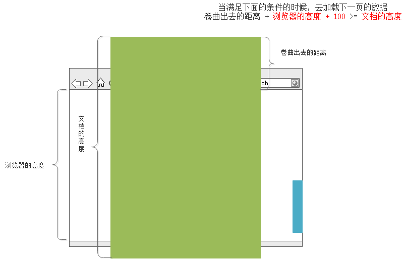
    
    

```JS
/////////////////////////////////////////////////////
// 懒加载
// 当滚动条滚动的时候，计算卷曲出去的距离、浏览器的高度、文档的高度
// 当 卷曲出去的距离 + 浏览器的高度 + 100 >= 文档的高度 ，说明滚动条快接近底部
$(window).scroll(function () {
    var scrollTop = $(document).scrollTop();
    var winHeight = $(window).height();
    var documentHeight = $(document).height();
    if (scrollTop + winHeight + 100 >= documentHeight) {
        // 此时说明 滚动条快接近底部，此时可以去加载另外的数据了
        // 这个判断，非常有可能触发多次
        console.log(124124);
    }
});
```


#### 封装加载每一页数据的函数

```js
// 定义一个表示页码的变量
var p = 1;

function loadData() {
    $.ajax({
        type: 'GET',
        url: '/member/list-page',
        data: { page: p },
        dataType: 'json',
        success: function (res) {
            console.log(res);
            // 1、定义空字符串，用于保存所有的会员
            var str = '';
            // 2. 遍历res，拼接空字符串
            res.forEach(function (item) {
                str += `<div class="col-lg-4 col-md-6">
                        <div class="card mb-4">
                        <div class="card-img-top py-4 bg-dark text-center">
                        
                        <h3 class="card-title text-light">${item.name}</h3>
                        </div>
                        <div class="card-body">
                        <p class="card-text">${item.bio}</p>
                        <a href="detail.html?id=${item.id}" class="card-link">View</a>
                        <a href="#" class="card-link text-danger" data-id="${item.id}">Delete</a>
                        </div>
                        </div>
                        </div>`;
            });
            // 3. 遍历之后，得到了所有会员，把字符串放到id为members的div中
            $('#members').append(str);
        }
    });
}

// 页面刷新，先调用一次loadData()
loadData();
```

当滚动条快接近底部的时候，去调用loadData即可

```js
$(window).scroll(function () {
    var winHeight = $(window).height(); // 浏览器的高度
    var scrollTop = $(document).scrollTop(); // 卷曲出去的距离
    var documentHeight = $(document).height(); // 文档的高度
    if (winHeight + scrollTop + 100 >= documentHeight && flag === true) {
        // 此时去加载下一页的数据
        console.log(123); // 位置是这里，可能有BUG，可能多次加载数据
        // 2. 如何加载下一页的数据
        p++;
        loadData();
    }
});
```

#### 解决重复加载的BUG

加入flag，控制何时允许去加载6条数据

```js
var flag = true; // 全局变量，控制此时是否可以去加载更多数据了。默认true表示允许加载

// 在loadData函数中，改变flag的值
function loadData() {
    // 表示开始加载数据
    flag = false; // 置为false的意思是，不允许去加载下一页的数据
    $.ajax({
        type: 'GET',
        url: '/member/list-page',
        data: { page: p },
        dataType: 'json',
        success: function (res) {
            console.log(res);
            // 1、定义空字符串，用于保存所有的会员
            var str = '';
            // 2. 遍历res，拼接空字符串
            res.forEach(function (item) {
                str += `<div class="col-lg-4 col-md-6">
                        <div class="card mb-4">
                        <div class="card-img-top py-4 bg-dark text-center">
                        
                        <h3 class="card-title text-light">${item.name}</h3>
                        </div>
                        <div class="card-body">
                        <p class="card-text">${item.bio}</p>
                        <a href="detail.html?id=${item.id}" class="card-link">View</a>
                        <a href="#" class="card-link text-danger" data-id="${item.id}">Delete</a>
                        </div>
                        </div>
                        </div>`;
            });
            // 3. 遍历之后，得到了所有会员，把字符串放到id为members的div中
            $('#members').append(str);
            // 表示当前这一页的数据处理完毕了
            flag = true;
        }
    });
}


//////////////////////////////////////////////////////////////////////////////
// 滚动条滚动时，加入flag判断
$(window).scroll(function () {
    var winHeight = $(window).height(); // 浏览器的高度
    var scrollTop = $(document).scrollTop(); // 卷曲出去的距离
    var documentHeight = $(document).height(); // 文档的高度
    if (winHeight + scrollTop + 100 >= documentHeight && flag === true) {
        // 此时去加载下一页的数据
        console.log(123); // 位置是这里，可能有BUG，可能多次加载数据
        // 2. 如何加载下一页的数据
        p++;
        loadData();
    }
});
```

